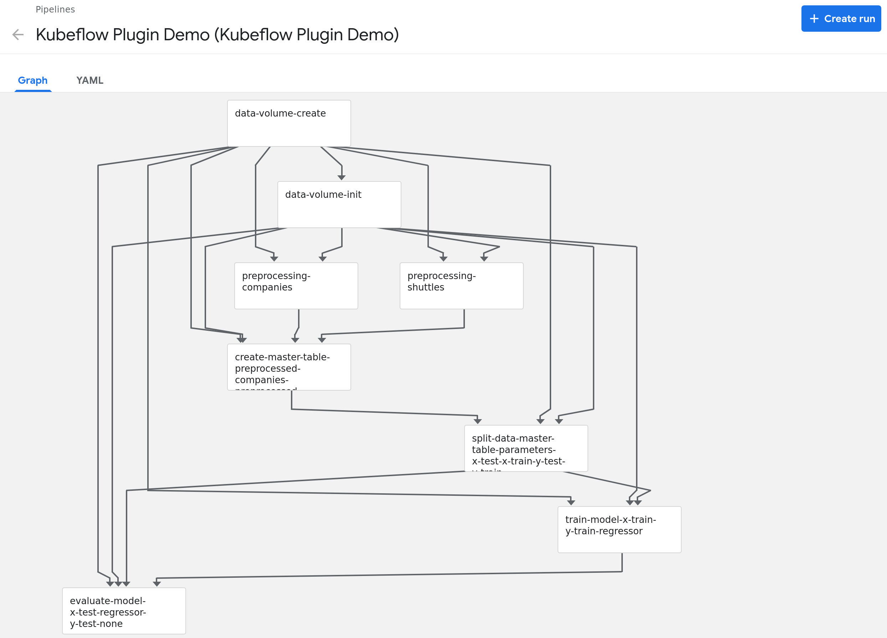
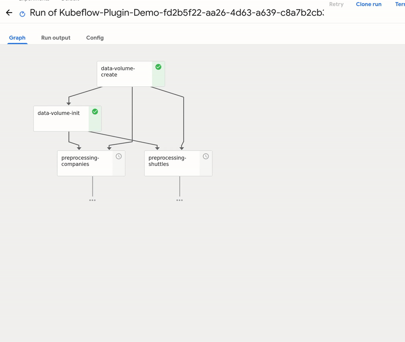
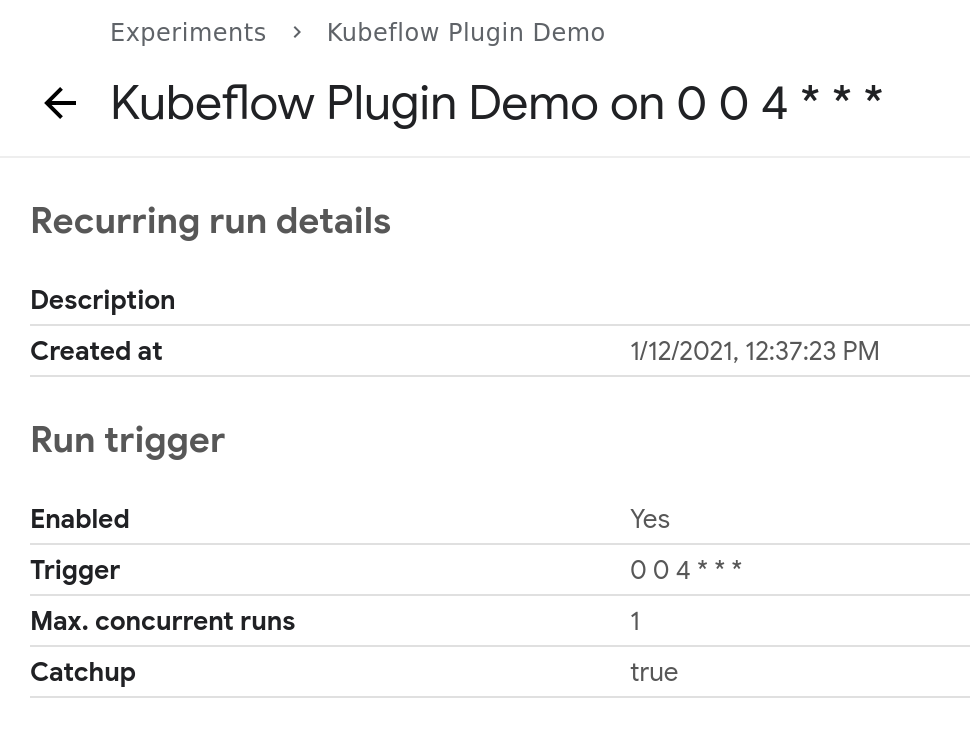

# Quickstart

(prerequisites-tag)=
## Prerequisites

The quickstart assumes user have access to Kubeflow Pipelines deployment. Pipelines can be deployed on any Kubernetes cluster, including [local cluster](https://www.kubeflow.org/docs/pipelines/installation/localcluster-deployment/).

````{admonition} Local kubeflow cluster
There is also an option to test locally with running [Kubernetes in docker](https://getindata.com/blog/kubeflow-pipelines-running-5-minutes/) (kind). After going through that guide you should have Kubeflow up and running available at `http://localhost:9000`.
````

## Install the toy project with Kubeflow Pipelines support

It is a good practice to start by creating a new virtualenv before installing new packages. Therefore, use `virtalenv` command to create new env and activate it:

```console
$ virtualenv venv-demo
created virtual environment CPython3.8.5.final.0-64 in 145ms
  creator CPython3Posix(dest=/home/mario/kedro/venv-demo, clear=False, no_vcs_ignore=False, global=False)
  seeder FromAppData(download=False, pip=bundle, setuptools=bundle, wheel=bundle, via=copy, app_data_dir=/home/mario/.local/share/virtualenv)
    added seed packages: pip==20.3.1, setuptools==51.0.0, wheel==0.36.2
  activators BashActivator,CShellActivator,FishActivator,PowerShellActivator,PythonActivator,XonshActivator
$ source venv-demo/bin/activate
```

Then, `kedro` must be present to enable cloning the starter project, along with the latest version of `kedro-kubeflow` plugin and `kedro-docker` (required to build docker images with the Kedro pipeline nodes):

```console
$ pip install 'kedro<0.18' kedro-kubeflow kedro-docker
```

With the dependencies in place, let's create a new project (with the latest supported kedro version - 0.17.7):

```console
$ kedro new --starter=spaceflights --checkout=0.17.7

Project Name:
=============
Please enter a human readable name for your new project.
Spaces and punctuation are allowed.
 [New Kedro Project]: Kubeflow Plugin Demo

Repository Name:
================
Please enter a directory name for your new project repository.
Alphanumeric characters, hyphens and underscores are allowed.
Lowercase is recommended.
 [kubeflow-plugin-demo]: 

Python Package Name:
====================
Please enter a valid Python package name for your project package.
Alphanumeric characters and underscores are allowed.
Lowercase is recommended. Package name must start with a letter or underscore.
 [kubeflow_plugin_demo]: 

Change directory to the project generated in /home/mario/kedro/kubeflow-plugin-demo

A best-practice setup includes initialising git and creating a virtual environment before running `kedro install` to install project-specific dependencies. Refer to the Kedro documentation: https://kedro.readthedocs.io/
```

Next go the demo project directory:
```console
$ cd kubeflow-plugin-demo/
```

Before installing the dependencies, add the `kedro-kubeflow` to `requirements.*` in src:
```console
$ echo kedro-kubeflow >> src/requirements*
```

Finally, ensure that kedro-kubeflow plugin is activated:

```console
$ pip install -r src/requirements.txt
(...)
Requirements installed!
$ kedro kubeflow --help
Usage: kedro kubeflow [OPTIONS] COMMAND [ARGS]...

  Interact with Kubeflow Pipelines

Options:
  -e, --env TEXT  Environment to use.
  -h, --help      Show this message and exit.

Commands:
  compile          Translates Kedro pipeline into YAML file with Kubeflow...
  init             Initializes configuration for the plugin
  list-pipelines   List deployed pipeline definitions
  mlflow-start
  run-once         Deploy pipeline as a single run within given experiment.
  schedule         Schedules recurring execution of latest version of the...
  ui               Open Kubeflow Pipelines UI in new browser tab
  upload-pipeline  Uploads pipeline to Kubeflow server
```

## Build the docker image to be used on Kubeflow Pipelines runs

First, initialize the project with `kedro-docker` configuration by running:

```console
$ kedro docker init
```

This command creates a several files, including `.dockerignore`. This file ensures that transient files are not included in the docker image and it requires small adjustment. Open it in your favorite text editor and extend the section `# except the following` by adding there:

```console
$ echo !data/01_raw >> .dockerignore
```

This change enforces raw data existence in the image. Also, one of the limitations of running the Kedro pipeline on Kubeflow (and not on local environemt) is inability to use `MemoryDataSets`, as the pipeline nodes do not share memory, so every artifact and intermediate data step should be stored as a file. The `spaceflights` demo configures four datasets as in-memory, so we need to change that. Replace the `conf/base/catalog.yml` with the following:

```yaml
companies:
  type: pandas.CSVDataSet
  filepath: data/01_raw/companies.csv
  layer: raw

reviews:
  type: pandas.CSVDataSet
  filepath: data/01_raw/reviews.csv
  layer: raw

shuttles:
  type: pandas.ExcelDataSet
  filepath: data/01_raw/shuttles.xlsx
  layer: raw
  load_args:
    engine: openpyxl

data_processing.preprocessed_companies:
  type: pandas.ParquetDataSet
  filepath: data/02_intermediate/preprocessed_companies.pq
  layer: intermediate

data_processing.preprocessed_shuttles:
  type: pandas.ParquetDataSet
  filepath: data/02_intermediate/preprocessed_shuttles.pq
  layer: intermediate

model_input_table:
  type: pandas.ParquetDataSet
  filepath: data/03_primary/model_input_table.pq
  layer: primary

data_science.active_modelling_pipeline.regressor:
  type: pickle.PickleDataSet
  filepath: data/06_models/regressor_active.pickle
  versioned: true
  layer: models

data_science.candidate_modelling_pipeline.regressor:
  type: pickle.PickleDataSet
  filepath: data/06_models/regressor_candidate.pickle
  versioned: true
  layer: models

data_science.active_modelling_pipeline.X_train:
  type: pickle.PickleDataSet
  filepath: data/05_model_input/X_train.pickle
  layer: model_input

data_science.active_modelling_pipeline.y_train:
  type: pickle.PickleDataSet
  filepath: data/05_model_input/y_train.pickle
  layer: model_input

data_science.active_modelling_pipeline.X_test:
  type: pickle.PickleDataSet
  filepath: data/05_model_input/X_test.pickle
  layer: model_input

data_science.active_modelling_pipeline.y_test:
  type: pickle.PickleDataSet
  filepath: data/05_model_input/y_test.pickle
  layer: model_input

data_science.active_modelling_pipeline.regressor:
  type: pickle.PickleDataSet
  filepath: data/06_models/regressor.pickle
  versioned: true
  layer: models

data_science.candidate_modelling_pipeline.X_train:
  type: pickle.PickleDataSet
  filepath: data/05_model_input/X_train.pickle
  layer: model_input

data_science.candidate_modelling_pipeline.y_train:
  type: pickle.PickleDataSet
  filepath: data/05_model_input/y_train.pickle
  layer: model_input

data_science.candidate_modelling_pipeline.X_test:
  type: pickle.PickleDataSet
  filepath: data/05_model_input/X_test.pickle
  layer: model_input

data_science.candidate_modelling_pipeline.y_test:
  type: pickle.PickleDataSet
  filepath: data/05_model_input/y_test.pickle
  layer: model_input

data_science.candidate_modelling_pipeline.regressor:
  type: pickle.PickleDataSet
  filepath: data/06_models/regressor.pickle
  versioned: true
  layer: models
```

Finally, build the image:

```console
$ kedro docker build
```

When execution finishes, your docker image is ready. If you don't use local cluster, you should push the image to the remote repository:

```console
$ docker tag kubeflow-plugin-demo:latest remote.repo.url.com/kubeflow-plugin-demo:latest
$ docker push remote.repo.url.com/kubeflow-plugin-demo:latest
```

````{admonition} Local cluster testing
The `kind` has its own docker registry that you need to upload the image to. However, since it does not have any connection to other registry we want to prevent it from trying to pull any image ([see the docs](https://kind.sigs.k8s.io/docs/user/quick-start/#loading-an-image-into-your-cluster)). In order to do that, we need to tag the built docker image with any specific version. Let's use `demo` tag, as any tag other than `latest` will do.

Locate your image name (it should be the same as kedro project name) with:
```console
$ docker images
```

Then tag your image with the following command:
```console
$ docker tag <image>:latest <image>:demo
```

Then you need to upload the image from local registry to the kind registry. Here `kfp` is the cluster name (the same as [in linked guide](prerequisites-tag). Default cluster name is `kind`.
```console
$ kind load docker-image <image>:demo --name kfp
```
````

## Run the pipeline on Kubeflow

First, run `init` script to create the sample configuration. A parameter value should reflect the kubeflow base path **as seen from the system** (so no internal Kubernetes IP unless you run the local cluster):

```console
$ kedro kubeflow init https://kubeflow.cluster.com
(...)
Configuration generated in /home/user/kedro/kubeflow-plugin-demo/conf/base/kubeflow.yaml
```

````{admonition} Local cluster testing
For local cluster the link is the following: `http://localhost:9000`
````


````{warning}
Since kedro 0.17 there have been introduced name spaces to datasets which are not yet fully supported by this plugin as it causes issues within naming conventions of kfp artifacts. For now it's best to disable storage of kfp artifacts by adding/uncommenting the following line in `conf/base/kubeflow.yaml`:
```yaml
store_kedro_outputs_as_kfp_artifacts: False
```
````

Then, if needed, adjust the `conf/base/kubeflow.yaml`. For example, the `image:` key should point to the full image name (like `remote.repo.url.com/kubeflow_plugin_demo:latest` if you've pushed the image at this name). Depending on the storage classes availability in Kubernetes cluster, you may want to modify `volume.storageclass` and `volume.access_modes` (please consult with Kubernetes admin what values should be there).


````{admonition} Local cluster testing
In this example you also need to update the tag of the `image:` part to also use `demo` instead latest.
````

````{warning}
The default limits of resources for node execution are too small for this example. Increase the following:
```yaml
  resources:
  (...)
    __default__:
      cpu: 200m
      memory: 64Mi
```
like that
```yaml
      cpu: 1
      memory: 1Gi
```
````

Finally, everything is set to run the pipeline on Kubeflow. Run `upload-pipeline`:

```console
$ kedro kubeflow upload-pipeline
2021-01-12 09:47:35,132 - kedro_kubeflow.kfpclient - INFO - No IAP_CLIENT_ID provided, skipping custom IAP authentication
2021-01-12 09:47:35,209 - kedro_kubeflow.kfpclient - INFO - Pipeline created
2021-01-12 09:47:35,209 - kedro_kubeflow.kfpclient - INFO - Pipeline link: https://kubeflow.cluster.com/#/pipelines/details/9a3e4e16-1897-48b5-9752-d350b1d1faac/version/9a3e4e16-1897-48b5-9752-d350b1d1faac
```

As you can see, the pipeline was compiled and uploaded into Kubeflow. Let's visit the link:



The Kubeflow pipeline reflects the Kedro pipeline with two extra steps:

 * `data-volume-create` - creates an empty volume in Kubernetes cluster as a persistence layer for inter-steps data access
 * `data-volume-init` - initialized the volume with `01_raw` data when the pipeline starts

By using `Create run` button you can start a run of the pipeline on the cluster. A run behaves like `kedro run` command, but the steps are executed on the remote cluster. The outputs are stored on the persistent volume, and passed as the inputs accordingly to how Kedro nodes need them.



````{tip}
You can also schedule a single run by using 
```console
$ kedro kubeflow run-once
```
````

From the UI you can access the logs of the execution. If everything seems fine, use `schedule to create a recurring run:

```console
$ kedro kubeflow schedule --cron-expression '0 0 4 * * *'
(...)
2021-01-12 12:37:23,086 - kedro_kubeflow.kfpclient - INFO - No IAP_CLIENT_ID provided, skipping custom IAP authentication
2021-01-12 12:37:23,096 - root - INFO - Creating experiment Kubeflow Plugin Demo.
2021-01-12 12:37:23,103 - kedro_kubeflow.kfpclient - INFO - New experiment created: 2123c082-b336-4093-bf3f-ce73f68b66b4
2021-01-12 12:37:23,147 - kedro_kubeflow.kfpclient - INFO - Pipeline scheduled to 0 0 4 * * *
```

You can see that the new experiment was created (that will group the runs) and the pipeline was scheduled. Please note, that Kubeflow uses 6-places cron expression (as opposite to Linux's cron with 5-places), where first place is the second indicator.


