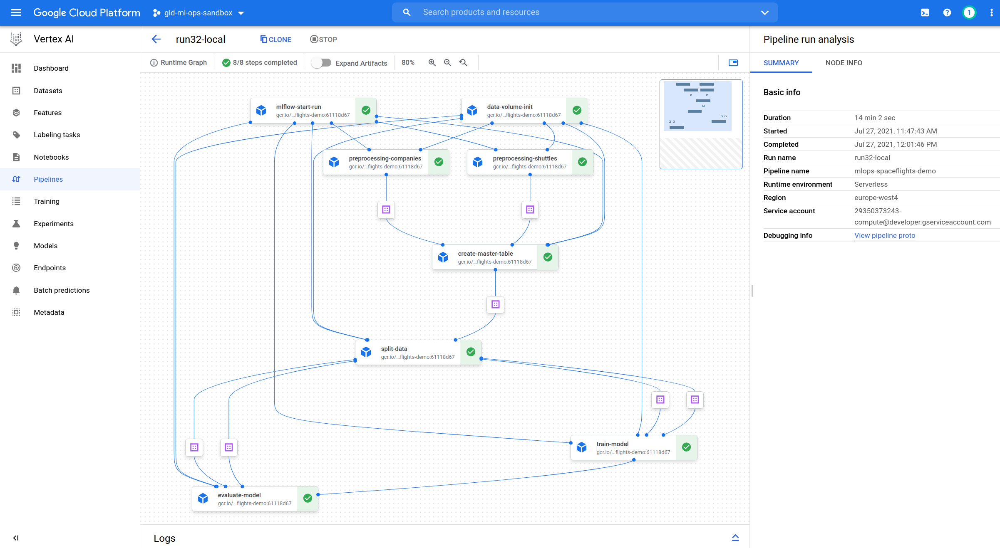

# GCP AI Platform support

Google Cloud's AI Platform offers couple services that simplify Machine Learning 
tasks with use of Kubeflow based components.

### Using `kedro` with AI Platform Notebooks

[AI Platform Notebooks](https://cloud.google.com/ai-platform-notebooks) provides 
an easy way to manage and host JupyterLab based data science workbench environment.
What we've found out is that the default images provided by a service cause some
dependency conflicts. To avoid this issues make sure you use isolated virtual
environment, e.g. [virtualenv](https://pypi.org/project/virtualenv/). New virual 
environment can be created by simply invoking `python -m virtualenv venv` command.

### Using `kedro-kubeflow` with AI Platform Pipelines

[AI Platform Pipelines](https://cloud.google.com/ai-platform/pipelines/docs/introduction)
is a service that allows to easily deploy [Kubeflow Pipelines](https://www.kubeflow.org/docs/pipelines/overview/pipelines-overview/)
on new or existing Google Kubernetes Engine clusters. 

In general `kedro-kubeflow` plugin should work with AI Platform Pipelines out of 
the box, with the only exception is that it requires authentication. Note that the `host` 
variable should point to a dashbard URL generated by AI Platform Pipelines service 
(e.g. https://653hddae86eb7b0-dot-europe-west1.pipelines.googleusercontent.com/), 
just open the dashboard from the [service page](https://console.cloud.google.com/ai-platform/pipelines/clusters)
and copy url from the browser. 

Below is the list of authentication scenarios supported so far: 

##### 1. Connecting to AI Pipelines from AI Platform Notebooks
In this scenario authentication works out of the box with _default credentials_ 
mechanism. 

##### 2. Authentication to AI Pipelines from local environment
To interact with AI Platform Pipelines from local environment you can use the 
mechanisms provided by [Google Cloud SDK](https://cloud.google.com/sdk). After
installing the SDK run `google cloud application-default login` to initialize 
_default credentials_ on your local machine. 

You can use service account key for authentication as well. To make that work just 
set `GOOGLE_APPLICATION_CREDENTIALS` environment variable to the path of where the
service account key file is stored.    

##### 3. Authenticating through IAP Proxy
[Identity Aware Proxy](https://cloud.google.com/iap) is a product that allows 
securing your cloud based applications with Google Identity. 

To authenticate with IAP find out which _oauth client ID_ is the proxy configured
with and then save it in `IAP_CLIENT_ID` environment variable. The authentication
should work seamlessly assuming identity you are using has been granted access to 
the application. 

The above will work if you are connecting from within GCP VM or locally with specified
service account credentials. It will *NOT* work for credentials obtained with `google
cloud application-default login`. 

### Using `kedro-kubeflow` with Vertex AI Pipelines (EXPERIMENTAL)

[Vertex AI Pipelines](https://cloud.google.com/vertex-ai/docs/pipelines)
is a fully managed service that allows to easily deploy 
[Kubeflow Pipelines](https://www.kubeflow.org/docs/pipelines/overview/pipelines-overview/)
on a serverless Google service. [Vertex AI Pipelines](https://cloud.google.com/vertex-ai/docs/pipelines)
was still in a Preview mode when this plugin version was released, therefore plugin
capability is also limited.

##### 1. Preparing configuration

In order the plugin picks Vertex AI Pipelines as a target infrastructure, it has to be indicated
in configuration. As the solution is serverless, no URL is to be provided. Instead, special set
of parameters has to be passed, so that connection is established with proper GCP service.

```yaml
host: vertex-ai-pipelines
project_id: hosting-project
region: europe-west4
run_config:
  root: vertex-ai-pipelines-accessible-gcs-bucket/pipelines-specific-path
```

If the pipeline requires access to services that are not exposed to public internet, you need to configure [VPC peering between Vertex internal network and VPC that hosts the internal service](https://cloud.google.com/vertex-ai/docs/general/vpc-peering) and then set the VPC identifier in the configuration. Optionally, you can add custom host aliases:

```yaml
run_config:
  vertex_ai_networking:
    vpc: projects/12345/global/networks/name-of-vpc
    host_aliases:
    - ip: 10.10.10.10
      hostnames: ['mlflow.internal']
    - ip: 10.10.20.20
      hostnames: ['featurestore.internal']
```

##### 2. Preparing environment variables

There're the following specific environment variables required for the pipeline to run correctly:
 * SERVICE_ACCOUNT - full email of service account that job will use to run the pipeline. Account has
to have access to `run_config.root` path. Variable is optional, if no given, project compute account is used
 * MLFLOW_TRACKING_TOKEN - identity token required if MLFlow is used inside the project and mlflow access
     is protected. Token is passed as it is to kedro nodes in order to authenticate against MLFlow service.
   Can be generated via `gcloud auth print-identity-token` command.
   
#### 3. Supported commands

Following commands are supported:

```bash
kedro kubeflow compile
kedro kubeflow run-once
kedro kubeflow schedule
kedro kubeflow list-pipelines
```



