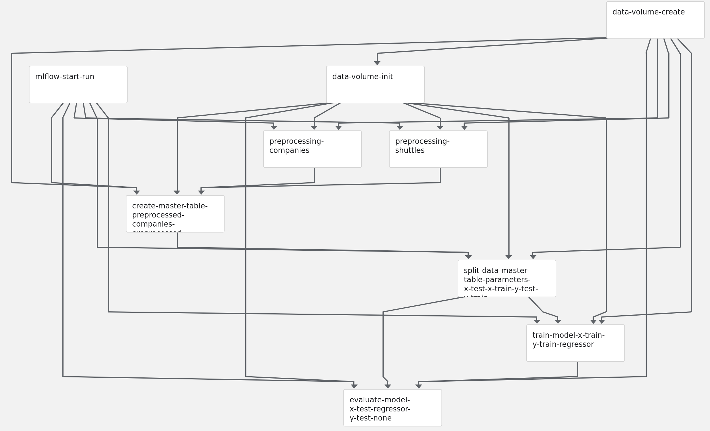
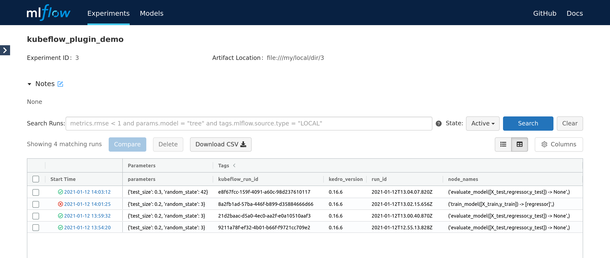

# Mlflow support

If you use [MLflow](https://mlflow.org/) and [kedro-mlflow](https://kedro-mlflow.readthedocs.io/) for the Kedro pipeline runs monitoring, the plugin will automatically enable support for:

* starting the experiment when the pipeline starts,
* logging all the parameters, tags, metrics and artifacts under unified MLFlow run.

To make sure that the plugin discovery mechanism works, add `kedro-mlflow` and `kedro-kubeflow` as a dependencies to `src/requirements.in` and run:

```console
$ pip-compile src/requirements.in > src/requirements.txt 
$ kedro install
$ kedro mlflow init
```

Then, adjust the kedro-mlflow configuration and point to the mlflow server by editing `conf/base/mlflow.yml` and adjusting `mlflow_tracking_uri` key. Then, build the image:

```console
$ kedro docker build
```

And re-push the image to the remote registry. Finally, re-upload the pipeline:

```console
$ kedro kubeflow upload-pipeline
(...)
2021-01-12 13:05:56,879 - kedro_kubeflow.kfpclient - INFO - No IAP_CLIENT_ID provided, skipping custom IAP authentication
2021-01-12 13:05:56,973 - kedro_kubeflow.kfpclient - INFO - New version of pipeline created: ba3a05c2-2f19-40c5-809e-0ed7c2989000
2021-01-12 13:05:56,973 - kedro_kubeflow.kfpclient - INFO - Pipeline link: http://10.43.54.89/#/pipelines/details/9a3e4e16-1897-48b5-9752-d350b1d1faac/version/ba3a05c2-2f19-40c5-809e-0ed7c2989000
```

And verify how does it look in the Kubeflow UI. You should notice `mlflow-start-run` step on the very top:



Finally, start the pipeline. While it executes, the new Mlflow run is started and it's constantly updated with the attributes provided by the next steps. Finally, the experiments runs page looks like:



The UI presents the pipeline status (in form of the icon) and latest node that was run (for failed runs in indicates at what step did the pipeline fail). Also, the `kubeflow_run_id` tag can be used to correlate Mlflow run with the Kubeflow pipeline execution.
